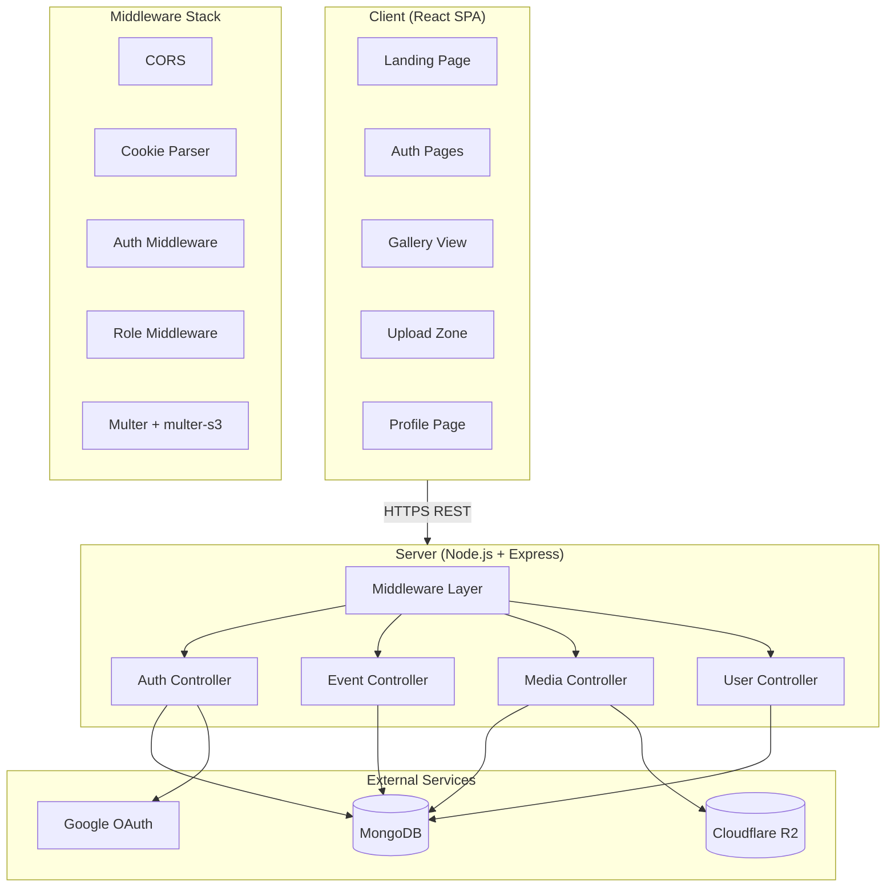
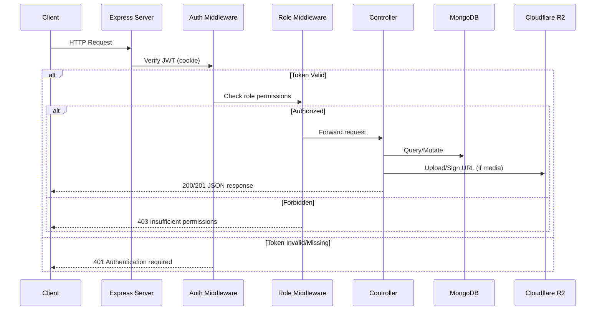
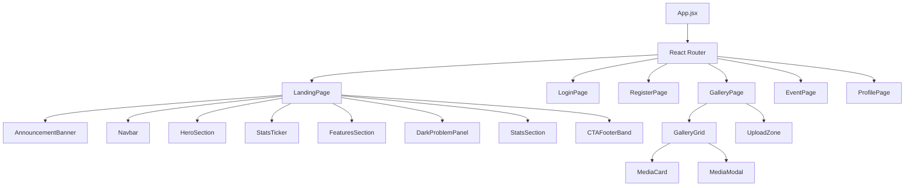
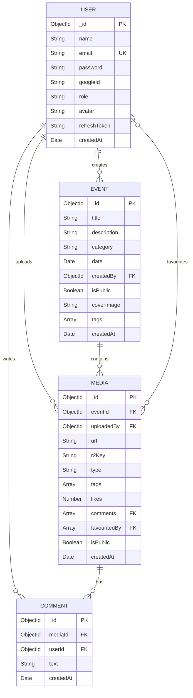

# Design Document: Antares Event Media Platform

## Overview

Antares is a full-stack event media platform enabling clubs and societies to upload, organize, and interact with event photos and videos. The system follows a client-server architecture with a React SPA frontend communicating with a Node.js/Express REST API, backed by MongoDB for persistence and Cloudflare R2 for media object storage.

The platform delivers:
- A polished, animated landing page with design-system-driven visuals
- JWT-based authentication with Google OAuth integration
- Role-based access control (admin, photographer, club_member, viewer)
- Media upload with server-side image compression and watermarking
- Gallery browsing with infinite scroll, sorting, and filtering
- Social interactions (favourites, comments) on media items

### Key Design Decisions

| Decision | Choice | Rationale |
|----------|--------|-----------|
| Frontend framework | React (JSX, no TS) | Team familiarity, rapid iteration |
| Styling | Tailwind CSS v4 @theme | Token-driven design system, zero CSS-in-JS overhead |
| Animation | Framer Motion + CSS @keyframes | Declarative animations with GPU-accelerated properties |
| State management | Zustand | Minimal boilerplate, no provider nesting |
| Backend | Node.js + Express | JavaScript full-stack consistency |
| Database | MongoDB + Mongoose | Flexible schemas for media metadata, embedded arrays |
| Object storage | Cloudflare R2 via S3 SDK | S3-compatible, no egress fees |
| Auth | JWT (access + refresh) | Stateless API auth with secure cookie storage |
| Image processing | Sharp | High-performance WebP conversion and watermarking |
| Upload streaming | multer + multer-s3 | Direct stream to R2, no temp disk usage |

## Architecture

### System Architecture Diagram



### Request Flow



### Project Structure

```
/server
├── config/
│   ├── db.js              # MongoDB connection
│   ├── r2.js              # R2 S3 client configuration
│   ├── passport.js        # Google OAuth strategy
│   └── env.js             # Environment variable validation
├── controllers/
│   ├── authController.js  # Register, login, logout, refresh, OAuth
│   ├── eventController.js # Event CRUD
│   ├── mediaController.js # Upload, retrieve, delete, favourite, comment
│   └── userController.js  # Profile operations
├── middleware/
│   ├── authMiddleware.js  # JWT verification
│   ├── roleMiddleware.js  # Role-based access guard
│   ├── uploadMiddleware.js # multer + multer-s3 config
│   └── errorHandler.js   # Global error handler
├── models/
│   ├── User.js
│   ├── Event.js
│   ├── Media.js
│   └── Comment.js
├── routes/
│   ├── authRoutes.js
│   ├── eventRoutes.js
│   ├── mediaRoutes.js
│   └── userRoutes.js
├── utils/
│   ├── imageProcessor.js  # Sharp compression + watermark
│   ├── tokenUtils.js      # JWT sign/verify helpers
│   └── validators.js      # Input validation schemas
└── index.js               # App entry point

/client
├── src/
│   ├── components/
│   │   ├── landing/
│   │   │   ├── AnnouncementBanner.jsx
│   │   │   ├── Navbar.jsx
│   │   │   ├── HeroSection.jsx
│   │   │   ├── StatsTicker.jsx
│   │   │   ├── FeaturesSection.jsx
│   │   │   ├── DarkProblemPanel.jsx
│   │   │   ├── StatsSection.jsx
│   │   │   └── CTAFooterBand.jsx
│   │   ├── gallery/
│   │   │   ├── GalleryGrid.jsx
│   │   │   ├── MediaCard.jsx
│   │   │   ├── UploadZone.jsx
│   │   │   └── MediaModal.jsx
│   │   ├── auth/
│   │   │   ├── LoginForm.jsx
│   │   │   ├── RegisterForm.jsx
│   │   │   └── GoogleAuthButton.jsx
│   │   ├── common/
│   │   │   ├── Button.jsx
│   │   │   ├── Input.jsx
│   │   │   ├── Badge.jsx
│   │   │   ├── EmptyState.jsx
│   │   │   └── ErrorMessage.jsx
│   │   └── layout/
│   │       ├── PageContainer.jsx
│   │       └── ProtectedRoute.jsx
│   ├── pages/
│   │   ├── LandingPage.jsx
│   │   ├── LoginPage.jsx
│   │   ├── RegisterPage.jsx
│   │   ├── GalleryPage.jsx
│   │   ├── EventPage.jsx
│   │   └── ProfilePage.jsx
│   ├── hooks/
│   │   ├── useAuth.js
│   │   ├── useMedia.js
│   │   ├── useInfiniteScroll.js
│   │   └── useAnimateOnScroll.js
│   ├── store/
│   │   ├── authStore.js
│   │   ├── mediaStore.js
│   │   └── eventStore.js
│   ├── utils/
│   │   ├── api.js          # Axios instance with interceptors
│   │   ├── constants.js
│   │   └── validators.js
│   ├── styles/
│   │   └── global.css      # Tailwind v4 @theme block
│   ├── App.jsx
│   └── main.jsx
├── index.html
├── vite.config.js
└── tailwind.config.js
```

## Components and Interfaces

### Backend API Interfaces

#### Authentication Endpoints (`/api/auth`)

| Method | Path | Auth | Role | Description |
|--------|------|------|------|-------------|
| POST | /api/auth/register | No | — | Create account with email/password |
| POST | /api/auth/login | No | — | Login, receive JWT cookies |
| POST | /api/auth/logout | Yes | Any | Invalidate refresh token, clear cookies |
| POST | /api/auth/refresh | No | — | Refresh access token via refresh cookie |
| GET | /api/auth/google | No | — | Redirect to Google OAuth consent |
| GET | /api/auth/google/callback | No | — | Handle Google OAuth callback |

#### Event Endpoints (`/api/events`)

| Method | Path | Auth | Role | Description |
|--------|------|------|------|-------------|
| POST | /api/events | Yes | admin, photographer | Create event |
| GET | /api/events | Yes | Any | List events (paginated, filtered by visibility) |
| GET | /api/events/:id | Yes | Any | Get single event |
| PUT | /api/events/:id | Yes | admin, creator | Update event |
| DELETE | /api/events/:id | Yes | admin, creator | Delete event + cascade |

#### Media Endpoints (`/api/media`)

| Method | Path | Auth | Role | Description |
|--------|------|------|------|-------------|
| POST | /api/media/upload/:eventId | Yes | admin, photographer | Upload media (single/bulk) |
| GET | /api/media | Yes | Any | List media (paginated, sorted, filtered) |
| GET | /api/media/:id | Yes | Any | Get single media item |
| GET | /api/media/:id/download | Yes | club_member+ | Get watermarked download URL |
| DELETE | /api/media/:id | Yes | admin, uploader | Delete media + cascade |
| POST | /api/media/:id/favourite | Yes | club_member+ | Toggle favourite |
| POST | /api/media/:id/comments | Yes | club_member+ | Add comment |
| GET | /api/media/:id/comments | Yes | Any | List comments for media |

#### User Endpoints (`/api/users`)

| Method | Path | Auth | Role | Description |
|--------|------|------|------|-------------|
| GET | /api/users/me | Yes | Any | Get current user profile |
| PUT | /api/users/me | Yes | Any | Update profile |
| GET | /api/users/me/favourites | Yes | Any | Get user's favourited media |
| PUT | /api/users/:id/role | Yes | admin | Change user role |

### Frontend Component Hierarchy



### Middleware Pipeline

```
Request → CORS → cookieParser → JSON body parser
  → authMiddleware (JWT verify from cookie)
  → roleMiddleware (check user.role against required roles)
  → uploadMiddleware (multer-s3 for media routes)
  → Controller
  → errorHandler (catch-all)
```

### Key Component Interfaces

#### `imageProcessor.js`

```javascript
// Compress image to max 2048px, convert to WebP
async function compressImage(inputBuffer) → Buffer

// Apply watermark with user name and date
async function applyWatermark(inputBuffer, { userName, date }) → Buffer
```

#### `tokenUtils.js`

```javascript
function generateAccessToken(userId) → string   // 15min expiry
function generateRefreshToken(userId) → string  // 7day expiry
function verifyAccessToken(token) → { userId }
function verifyRefreshToken(token) → { userId }
function setAuthCookies(res, accessToken, refreshToken) → void
function clearAuthCookies(res) → void
```

#### `authMiddleware.js`

```javascript
// Extracts JWT from httpOnly cookie, verifies, attaches user to req
async function authMiddleware(req, res, next) → void
```

#### `roleMiddleware.js`

```javascript
// Factory: returns middleware that checks req.user.role against allowed roles
function roleMiddleware(...allowedRoles) → (req, res, next) → void
```

#### Zustand Stores

```javascript
// authStore.js
{
  user: null | UserObject,
  isAuthenticated: boolean,
  login: (credentials) => Promise,
  register: (data) => Promise,
  logout: () => Promise,
  refreshToken: () => Promise,
  googleLogin: () => void,
}

// mediaStore.js
{
  items: MediaObject[],
  hasMore: boolean,
  page: number,
  sortBy: 'uploadDate' | 'eventDate' | 'likes',
  sortOrder: 'asc' | 'desc',
  eventFilter: string | null,
  fetchMedia: () => Promise,
  loadMore: () => Promise,
  setSort: (sortBy, sortOrder) => void,
  setEventFilter: (eventId) => void,
  toggleFavourite: (mediaId) => Promise,
  addComment: (mediaId, text) => Promise,
}

// eventStore.js
{
  events: EventObject[],
  currentEvent: EventObject | null,
  fetchEvents: () => Promise,
  createEvent: (data) => Promise,
  updateEvent: (id, data) => Promise,
  deleteEvent: (id) => Promise,
}
```

## Data Models

### Entity Relationship Diagram



### Mongoose Schema Definitions

#### User Schema

```javascript
const userSchema = new Schema({
  name: { type: String, required: true, maxlength: 100 },
  email: { type: String, required: true, unique: true, maxlength: 254,
           match: /^[^\s@]+@[^\s@]+\.[^\s@]+$/ },
  password: { type: String, maxlength: 128 },
  googleId: { type: String, maxlength: 255 },
  role: { type: String, enum: ['admin', 'photographer', 'club_member', 'viewer'],
          default: 'viewer' },
  avatar: { type: String, maxlength: 2048 },
  refreshToken: { type: String },
  createdAt: { type: Date, default: Date.now }
});
```

#### Event Schema

```javascript
const eventSchema = new Schema({
  title: { type: String, required: true, maxlength: 150 },
  description: { type: String, maxlength: 2000 },
  category: { type: String, maxlength: 50 },
  date: { type: Date },
  createdBy: { type: Schema.Types.ObjectId, ref: 'User', required: true },
  isPublic: { type: Boolean, default: true },
  coverImage: { type: String, maxlength: 2048 },
  tags: { type: [String], validate: [v => v.length <= 20, 'Max 20 tags'] },
  createdAt: { type: Date, default: Date.now }
});
```

#### Media Schema

```javascript
const mediaSchema = new Schema({
  eventId: { type: Schema.Types.ObjectId, ref: 'Event', required: true },
  uploadedBy: { type: Schema.Types.ObjectId, ref: 'User', required: true },
  url: { type: String, required: true, maxlength: 2048 },
  r2Key: { type: String, required: true, maxlength: 512 },
  type: { type: String, enum: ['photo', 'video'], required: true },
  tags: { type: [String], validate: [v => v.length <= 30, 'Max 30 tags'] },
  likes: { type: Number, default: 0, min: 0 },
  comments: [{ type: Schema.Types.ObjectId, ref: 'Comment' }],
  favouritedBy: [{ type: Schema.Types.ObjectId, ref: 'User' }],
  isPublic: { type: Boolean, default: true },
  createdAt: { type: Date, default: Date.now }
});
```

#### Comment Schema

```javascript
const commentSchema = new Schema({
  mediaId: { type: Schema.Types.ObjectId, ref: 'Media', required: true },
  userId: { type: Schema.Types.ObjectId, ref: 'User', required: true },
  text: { type: String, required: true, minlength: 1, maxlength: 1000 },
  createdAt: { type: Date, default: Date.now }
});
```

### Cascade Deletion Logic

| Trigger | Actions |
|---------|---------|
| User deleted | Remove all user's Comments; remove userId from all Media.favouritedBy arrays |
| Event deleted | Remove all Media for that event; remove all Comments for those Media; delete R2 objects |
| Media deleted | Remove all Comments for that media; delete R2 object |

