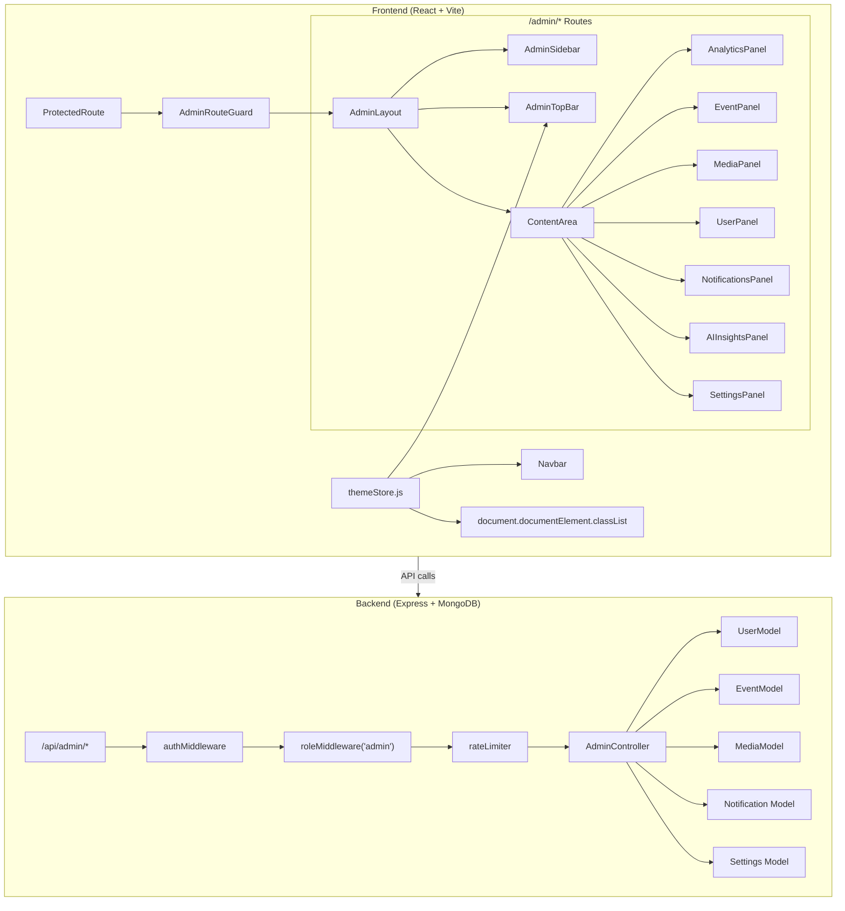

# Design Document: Dark Mode & Admin Dashboard

## Overview

This design covers two tightly coupled features for the Antares platform:

1. **Global Dark Mode System** — A Zustand-based theme store replacing the existing local state in Navbar, with localStorage persistence, system preference detection, and synchronous DOM class toggling. The existing `@custom-variant dark (&:where(.dark, .dark *))` in global.css is leveraged as-is.

2. **Admin Dashboard** — A protected SaaS-style management interface at `/admin/*` with a collapsible sidebar, glassmorphism card aesthetic, analytics charts, and CRUD panels for events, media, users, notifications, and settings. Backend support via new `/api/admin/*` endpoints with role-guarded access.

### Key Design Decisions

| Decision | Choice | Rationale |
|----------|--------|-----------|
| Theme store | Zustand with manual localStorage | Matches existing store pattern (authStore, mediaStore, eventStore); no middleware needed for simple string persistence |
| Dark mode CSS | Existing `@custom-variant dark` + Tailwind `dark:` prefix | Already wired up in global.css; zero config change needed |
| Chart library | **Chart.js** via `react-chartjs-2` | Lightweight (~60KB gzipped), no TypeScript requirement, works with plain JSX, well-maintained |
| Admin layout | CSS Grid with fixed sidebar + scrollable content | Simple, performant, no layout library needed |
| Glassmorphism | Reusable `GlassCard` component | Encapsulates backdrop-filter, border, radius, and theme-aware background |
| Animations | Framer Motion (already installed) | Consistent with existing page transitions in App.jsx |
| Rate limiting | `express-rate-limit` package | Lightweight, well-maintained, simple per-route configuration |

---

## Architecture



### Route Structure

**Frontend routes:**
- `/admin` → Analytics Overview (default)
- `/admin/events` → Event Management
- `/admin/media` → Media Management
- `/admin/users` → User & Role Management
- `/admin/notifications` → Notifications
- `/admin/ai-insights` → AI Insights (placeholder)
- `/admin/settings` → Settings

**Backend routes:**
- `GET /api/admin/analytics` → Aggregate counts + time-series
- `GET /api/admin/users` → Paginated user list
- `PATCH /api/admin/users/:id/role` → Update user role
- `GET /api/admin/notifications` → List notifications
- `PATCH /api/admin/notifications/:id/read` → Mark as read
- `GET /api/admin/notifications/unread-count` → Unread count
- `GET /api/admin/settings` → Get platform settings
- `PUT /api/admin/settings` → Update platform settings

---

## Components and Interfaces

### Theme Store (`client/src/store/themeStore.js`)

```javascript
// Zustand store — no middleware, manual localStorage sync
const useThemeStore = create((set) => ({
  theme: getInitialTheme(), // reads localStorage or matchMedia
  toggleTheme: () => set((state) => {
    const next = state.theme === 'dark' ? 'light' : 'dark';
    localStorage.setItem('theme', next);
    applyThemeToDOM(next);
    return { theme: next };
  }),
}));

function getInitialTheme() {
  const stored = localStorage.getItem('theme');
  if (stored) return stored;
  return window.matchMedia('(prefers-color-scheme: dark)').matches ? 'dark' : 'light';
}

function applyThemeToDOM(theme) {
  if (theme === 'dark') {
    document.documentElement.classList.add('dark');
  } else {
    document.documentElement.classList.remove('dark');
  }
}
```

### Theme Toggle Component (`client/src/components/common/ThemeToggle.jsx`)

```jsx
// Accessible toggle button consuming themeStore
// Props: none (reads from store directly)
// Renders: sun icon (dark→light) or moon icon (light→dark)
// aria-label: dynamic based on current theme
```

### GlassCard Component (`client/src/components/common/GlassCard.jsx`)

```jsx
// Reusable glassmorphism card
// Props: { children, className, animate (boolean, default true) }
// Styles:
//   - backdrop-filter: blur(12px)
//   - background: rgba(24,24,27,0.6) dark / rgba(255,255,255,0.6) light
//   - border: 1px solid graphite (dark) / fog (light)
//   - border-radius: 36px (--radius-card)
//   - padding: 24px
// Animation (Framer Motion):
//   - initial: { opacity: 0, scale: 0.97 }
//   - animate: { opacity: 1, scale: 1 }
//   - transition: { duration: 0.4 }
//   - whileHover: { scale: 1.01, transition: { duration: 0.2 } }
```

### Admin Layout (`client/src/components/admin/AdminLayout.jsx`)

```jsx
// Wraps all /admin/* routes
// Structure:
//   <div className="flex h-screen">
//     <AdminSidebar />
//     <div className="flex-1 flex flex-col overflow-hidden">
//       <AdminTopBar />
//       <main className="flex-1 overflow-y-auto p-6">
//         <Outlet /> {/* renders active panel */}
//       </main>
//     </div>
//   </div>
```

### AdminSidebar (`client/src/components/admin/AdminSidebar.jsx`)

```jsx
// Props: none (internal collapsed state)
// State: collapsed (boolean), responsive auto-collapse below 768px
// Width: 240px expanded, 64px collapsed
// Animation: Framer Motion width interpolation 0.25s easeInOut
// Nav items: icon + label (label hidden when collapsed)
// Sections: Analytics, Events, Media, Users, Notifications, AI Insights, Settings
```

### AdminTopBar (`client/src/components/admin/AdminTopBar.jsx`)

```jsx
// Height: 64px, fixed at top of content area
// Contains: section title, notifications bell (with unread badge), user avatar+name, ThemeToggle
// Notifications dropdown: shows 5 most recent on bell click
```

### AdminRouteGuard (`client/src/components/layout/AdminRouteGuard.jsx`)

```jsx
// Wraps AdminLayout
// Checks: isAuthenticated AND user.role === 'admin'
// Unauthenticated → redirect /login
// Non-admin → redirect /
// Admin → render children
```

### Panel Components

| Component | Path | Key Features |
|-----------|------|--------------|
| `AnalyticsPanel` | `pages/admin/AnalyticsPanel.jsx` | 4 metric GlassCards, 2 line charts (Chart.js), error/retry state |
| `EventManagementPanel` | `pages/admin/EventManagementPanel.jsx` | Table with search/filter, create/edit modals, delete confirmation |
| `MediaManagementPanel` | `pages/admin/MediaManagementPanel.jsx` | Grid/table toggle, bulk select, bulk actions, filter controls |
| `UserManagementPanel` | `pages/admin/UserManagementPanel.jsx` | Table with search, inline role dropdown, error rollback |
| `NotificationsPanel` | `pages/admin/NotificationsPanel.jsx` | Chronological list, mark-as-read, real-time prepend |
| `AIInsightsPanel` | `pages/admin/AIInsightsPanel.jsx` | Placeholder cards, "coming soon" messaging |
| `SettingsPanel` | `pages/admin/SettingsPanel.jsx` | Form fields, validation, save/error feedback |

---

## Data Models

### Notification Model (`server/models/Notification.js`)

```javascript
const notificationSchema = new Schema({
  type: {
    type: String,
    enum: ['media_upload', 'user_registration', 'comment'],
    required: true
  },
  title: {
    type: String,
    required: true,
    maxlength: 200
  },
  message: {
    type: String,
    required: true,
    maxlength: 500
  },
  relatedUser: {
    type: Schema.Types.ObjectId,
    ref: 'User'
  },
  relatedMedia: {
    type: Schema.Types.ObjectId,
    ref: 'Media'
  },
  relatedEvent: {
    type: Schema.Types.ObjectId,
    ref: 'Event'
  },
  isRead: {
    type: Boolean,
    default: false
  },
  createdAt: {
    type: Date,
    default: Date.now
  }
});
```

### Settings Model (`server/models/Settings.js`)

```javascript
const settingsSchema = new Schema({
  key: {
    type: String,
    default: 'platform_settings',
    unique: true
  },
  uploadSizeLimit: {
    type: Number,
    required: true,
    min: 1,
    default: 50 // MB
  },
  maxBulkUploadCount: {
    type: Number,
    required: true,
    min: 1,
    default: 20
  },
  allowedImageTypes: {
    type: [String],
    default: ['image/jpeg', 'image/png', 'image/webp', 'image/gif']
  },
  allowedVideoTypes: {
    type: [String],
    default: ['video/mp4', 'video/webm', 'video/quicktime']
  },
  defaultVisibility: {
    type: String,
    enum: ['public', 'private'],
    default: 'public'
  },
  updatedAt: {
    type: Date,
    default: Date.now
  }
});
```

### Admin Controller Endpoints

| Endpoint | Method | Description | Response Shape |
|----------|--------|-------------|----------------|
| `/api/admin/analytics` | GET | Aggregate metrics + time-series | `{ totalEvents, totalMedia, totalUsers, totalStorage, uploadsPerDay: [{date, count}], registrationsPerDay: [{date, count}] }` |
| `/api/admin/users` | GET | Paginated user list | `{ users: [...], total, page, limit }` |
| `/api/admin/users/:id/role` | PATCH | Update role | `{ user: {...} }` |
| `/api/admin/notifications` | GET | Paginated notifications | `{ notifications: [...], total, page, limit }` |
| `/api/admin/notifications/:id/read` | PATCH | Mark as read | `{ notification: {...} }` |
| `/api/admin/notifications/unread-count` | GET | Unread count | `{ count: number }` |
| `/api/admin/settings` | GET | Current settings | `{ settings: {...} }` |
| `/api/admin/settings` | PUT | Update settings | `{ settings: {...} }` |

### Middleware Chain for Admin Routes

```javascript
// server/routes/adminRoutes.js
import { Router } from 'express';
import authMiddleware from '../middleware/authMiddleware.js';
import { roleMiddleware } from '../middleware/roleMiddleware.js';
import rateLimiter from '../middleware/rateLimiter.js';

const router = Router();

// All admin routes require auth + admin role + rate limit
router.use(authMiddleware);
router.use(roleMiddleware('admin'));
router.use(rateLimiter({ windowMs: 60000, max: 100 }));

// ... route handlers
export default router;
```

---


## Correctness Properties

*A property is a characteristic or behavior that should hold true across all valid executions of a system — essentially, a formal statement about what the system should do. Properties serve as the bridge between human-readable specifications and machine-verifiable correctness guarantees.*

### Property 1: Theme toggle round-trip

*For any* initial theme state (dark or light), invoking toggleTheme should produce the opposite value in the store, persist that value to localStorage under the key "theme", and set `document.documentElement.classList.contains('dark')` equal to `(newTheme === 'dark')`.

**Validates: Requirements 1.1, 1.4, 1.5**

### Property 2: Theme initialization priority

*For any* combination of localStorage "theme" value (present as "dark", present as "light", or absent) and system preference (dark or light), the Theme_Store should initialize to the localStorage value when present, and to the system preference value when localStorage has no "theme" key.

**Validates: Requirements 1.2, 1.3**

### Property 3: Theme-dependent attribute rendering

*For any* theme value (dark or light), the ThemeToggle aria-label should be "Switch to dark mode" when theme is light and "Switch to light mode" when theme is dark, and the GlassCard border color should be graphite (#3f3f46) when dark and fog (#ececee) when light.

**Validates: Requirements 2.3, 7.2**

### Property 4: Text search filtering correctness

*For any* non-empty search string and any list of items (events or users), the filtered result should contain only items where the searchable fields (title/category for events, name/email for users) contain the search string as a case-insensitive substring, and should contain all such matching items from the original list.

**Validates: Requirements 10.2, 12.2**

### Property 5: Bulk action targeting

*For any* subset of selected media item IDs and any bulk action (delete, make public, make private), the resulting API request payload should contain exactly the set of selected IDs — no more, no fewer.

**Validates: Requirements 11.4**

### Property 6: Notification chronological ordering

*For any* list of notifications with distinct timestamps, the rendered notification list should be ordered by createdAt descending (newest first), and the ordering should be stable for notifications with equal timestamps.

**Validates: Requirements 13.1**

### Property 7: Read state count invariant

*For any* set of notifications where N are unread (N > 0), marking exactly one unread notification as read should result in the unread count being N - 1, and the total notification count should remain unchanged.

**Validates: Requirements 13.5**

### Property 8: Settings validation rules

*For any* settings form input, validation should pass if and only if: uploadSizeLimit is a positive number AND allowedImageTypes contains at least one entry AND allowedVideoTypes contains at least one entry. All other combinations should fail validation and prevent form submission.

**Validates: Requirements 15.4**

### Property 9: Admin endpoint access control

*For any* request to any /api/admin/* endpoint, if the request lacks a valid authentication token OR the authenticated user's role is not "admin", the response status should be 403 with an error message indicating insufficient permissions.

**Validates: Requirements 16.5**

---

## Error Handling

### Frontend Error Handling

| Scenario | Behavior |
|----------|----------|
| Analytics API fetch fails | Display error state with "Retry" button; no stale data shown |
| Event/Media/User CRUD fails | Show toast notification with error message; revert optimistic UI updates |
| Role update fails | Revert dropdown to previous role value; show error toast |
| Settings save fails | Retain unsaved form values; show error notification |
| Network timeout | Show generic "Connection error" toast with retry suggestion |
| 403 on admin endpoint | Redirect to home page; clear admin state |
| 401 on any endpoint | Attempt token refresh; if refresh fails, redirect to login |

### Backend Error Handling

| Scenario | Status | Response |
|----------|--------|----------|
| Missing/invalid auth token | 401 | `{ success: false, error: "Authentication required" }` |
| Non-admin role | 403 | `{ success: false, error: "Insufficient permissions" }` |
| Rate limit exceeded | 429 | `{ success: false, error: "Too many requests. Try again later." }` |
| Invalid role value in PATCH | 400 | `{ success: false, error: "Invalid role. Must be one of: admin, photographer, club_member, viewer" }` |
| Settings validation failure | 400 | `{ success: false, error: "Validation failed", details: [...] }` |
| User not found | 404 | `{ success: false, error: "User not found" }` |
| Database error | 500 | `{ success: false, error: "Internal server error" }` |

### Theme Error Handling

| Scenario | Behavior |
|----------|----------|
| localStorage unavailable (private browsing) | Fall back to system preference; theme works in-memory only |
| matchMedia not supported | Default to "light" theme |
| Invalid value in localStorage "theme" key | Treat as absent; use system preference |

---

## Testing Strategy

### Unit Tests (Example-Based)

- **Theme Store**: Initialization with/without localStorage, toggle behavior, DOM class manipulation
- **ThemeToggle Component**: Correct icon rendering, aria-label values, click handler invocation
- **GlassCard Component**: Correct styles in dark/light mode, animation props
- **AdminRouteGuard**: Redirect behavior for unauthenticated, non-admin, and admin users
- **AdminSidebar**: Collapse/expand state, responsive behavior, nav link rendering
- **AdminTopBar**: Element presence (title, bell, avatar, toggle), notification badge count
- **Panel Components**: Correct rendering with mock data, error states, loading states
- **Settings Validation**: Specific valid/invalid input combinations
- **Admin Middleware Chain**: Auth + role + rate limit integration

### Property-Based Tests (Universal Properties)

**Library**: [fast-check](https://github.com/dubzzz/fast-check) (JavaScript PBT library, works with Vitest)

**Configuration**: Minimum 100 iterations per property test.

Each property test references its design document property via comment tag:

```javascript
// Feature: dark-mode-admin-dashboard, Property 1: Theme toggle round-trip
// Feature: dark-mode-admin-dashboard, Property 2: Theme initialization priority
// Feature: dark-mode-admin-dashboard, Property 4: Text search filtering correctness
// ... etc.
```

**Properties to implement:**
1. Toggle round-trip (store + localStorage + DOM consistency)
2. Initialization priority (localStorage vs system preference)
3. Theme-dependent attribute rendering (aria-label + border color)
4. Text search filtering (events and users)
5. Bulk action targeting (selected IDs in payload)
6. Notification chronological ordering
7. Read state count invariant
8. Settings validation rules
9. Admin endpoint access control (403 for non-admin)

### Integration Tests

- **Admin API endpoints**: Seed database, verify response shapes, pagination, and CRUD operations
- **Rate limiting**: Verify 429 after 100 requests/minute
- **Full auth flow**: Login → navigate to /admin → verify access
- **Theme persistence**: Set theme → reload page → verify theme persists

### Visual/Snapshot Tests

- Dark mode rendering of all existing pages (Landing, Login, Register, Gallery, Profile)
- Admin dashboard panels in both dark and light modes
- Responsive layouts at 375px, 768px, and 1200px breakpoints

