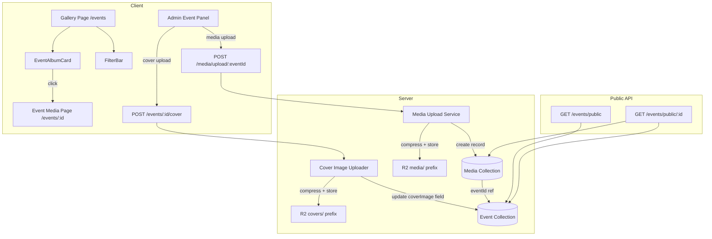

# Design Document: Event Media Architecture Refactor

## Overview

This refactor enforces a clean separation between **Event Cover Images** and **Event Media** across the full stack. The current system conflates cover images with gallery media — cover images are uploaded through the media endpoint, creating duplicate Media records that pollute the gallery. The gallery also displays a flat media grid with no event-based organization.

The refactored architecture introduces:
1. A dedicated cover image upload path (`POST /events/:id/cover`) that stores directly on the Event model without creating Media records
2. R2 key prefix separation (`covers/` vs `media/`) to physically segregate storage
3. An event-based gallery navigation pattern (Events grid → Event media page)
4. Client-side filtering by category and tags
5. A `/gallery` → `/events` redirect for backward compatibility
6. A migration script to clean up existing duplicate Media records

## Architecture



### Key Architectural Decisions

1. **Cover images on Event model** — The `coverImage` URL field lives directly on the Event document. No Media record is created for covers. This eliminates the duplication problem at the data layer.

2. **R2 prefix separation** — Cover images use `covers/{uuid}.webp` keys; media files use `media/{uuid}.ext` keys. This provides physical separation in object storage and makes cleanup/auditing straightforward.

3. **Event-based gallery navigation** — The gallery page shows event cards (not flat media). Users click into an event to see its media. This matches the mental model of "events contain photos."

4. **Client-side filtering** — Category and tag filtering happens client-side on the fetched events list. Given the expected dataset size (tens to low hundreds of events), this avoids extra API round-trips and provides instant feedback.

5. **`/gallery` redirect** — The old `/gallery` route redirects to `/events` for backward compatibility. The authenticated gallery page (flat media view) is removed.

6. **Migration over dual-write** — A one-time migration script cleans up existing duplicates rather than maintaining backward-compatible dual-write logic.

## Components and Interfaces

### Server Components

#### Cover Image Uploader (`uploadCoverImage` in eventController.js)

Already implemented. Handles `POST /events/:id/cover`:
- Accepts multipart file via multer memory storage
- Compresses to WebP (max 2048px) using Sharp
- Uploads to R2 with `covers/{uuid}.webp` key
- Deletes old cover from R2 if it existed under `covers/` prefix
- Updates `Event.coverImage` field
- Returns 503 on storage failure

**No changes needed** — this endpoint already exists and works correctly.

#### Media Upload Service (`uploadMedia` in mediaController.js)

Current behavior streams files to R2 via multer-s3, then compresses images. Needs modification:

- **Add event existence validation** — Before processing files, verify the `eventId` param references an existing Event. Return 404 if not found.
- **Add `media/` prefix to R2 keys** — Update the multer-s3 key function to prepend `media/` to all generated keys.

```javascript
// Updated key function in uploadMiddleware.js
key(req, file, cb) {
  const ext = path.extname(file.originalname);
  const uniqueName = `media/${crypto.randomUUID()}${ext}`;
  cb(null, uniqueName);
}
```

#### Public Events API (`listPublicEvents`, `getPublicEvent`)

Already implemented. No changes needed — these endpoints already return events with media counts and event-specific media.

#### Migration Script (`scripts/migrateCoverMedia.js`)

New file. Runs once to clean up existing duplicates:

```javascript
// Pseudocode
const events = await Event.find({ coverImage: { $exists: true, $ne: '' } });
for (const event of events) {
  const duplicates = await Media.find({ url: event.coverImage });
  // Delete Media records only (NOT R2 objects — Event still references them)
  await Media.deleteMany({ _id: { $in: duplicates.map(d => d._id) } });
  removedCount += duplicates.length;
}
console.log(`Migration complete: removed ${removedCount} duplicate Media records`);
```

### Client Components

#### Gallery Page (refactored `EventsPage.jsx` at `/events`)

The current `EventsPage.jsx` already displays event cards with pagination. Enhancements:
- Add `FilterBar` component for category/tag filtering
- The existing `/events` route and `EventsPage` component serve as the gallery

#### FilterBar (new component `components/events/FilterBar.jsx`)

Props:
- `events: Event[]` — full events list for extracting filter options
- `selectedCategory: string | null`
- `selectedTags: string[]`
- `onCategoryChange: (category: string | null) => void`
- `onTagsChange: (tags: string[]) => void`

Behavior:
- Extracts distinct categories from events
- Extracts distinct tags from all events
- Renders category dropdown + tag chips
- Calls parent callbacks on filter change

#### EventAlbumCard (existing `components/events/EventAlbumCard.jsx`)

Already implemented with cover image, title, category badge, media count, and date. Enhancement:
- Add tags display as pill chips below the title overlay

#### Event Media Page (existing `EventAlbumPage.jsx` at `/events/:id`)

Already implemented. Displays event hero banner (cover image) + paginated media grid. No structural changes needed.

#### App.jsx Routing Changes

- Add redirect from `/gallery` to `/events`
- Remove the `ProtectedRoute` wrapper from the gallery route (events page is public)
- The `/events` and `/events/:id` routes already exist

#### Admin Event Management Panel

Current implementation uploads covers through the media endpoint as a workaround. Refactor:
- Use `POST /events/:id/cover` with `FormData` containing the file under field name `avatar` (matching the multer memory storage middleware)
- Remove the workaround that creates events first then uploads media then patches coverImage

### Interface Contracts

#### `POST /events/:id/cover`
- **Auth**: Required (admin or event creator)
- **Content-Type**: `multipart/form-data`
- **Field**: `avatar` (single file)
- **Response 200**: `{ success: true, data: { coverImageUrl: string } }`
- **Response 503**: `{ success: false, error: "Storage service unavailable" }`

#### `POST /media/upload/:eventId`
- **Auth**: Required (admin or photographer)
- **Content-Type**: `multipart/form-data`
- **Field**: `files` (up to 50)
- **Validation**: eventId must reference existing Event (404 if not)
- **Response 201**: `{ success: true, data: { uploaded: Media[], rejected: [] } }`
- **Response 400**: Missing/invalid eventId
- **Response 404**: Event not found

#### `GET /events/public`
- **Auth**: None
- **Query**: `page`, `limit`, `category`, `tags` (comma-separated)
- **Response 200**: `{ success: true, data: { events: Event[], page, limit, total, totalPages } }`

## Data Models

### Event Model (existing — no schema changes)

```javascript
{
  title: String (required, max 150),
  description: String (max 2000),
  category: String (max 50),
  date: Date,
  createdBy: ObjectId → User (required),
  isPublic: Boolean (default true),
  coverImage: String (max 2048),  // R2 URL under covers/ prefix
  tags: [String] (max 20 tags, each max 50 chars),
  createdAt: Date
}
```

### Media Model (existing — no schema changes)

```javascript
{
  eventId: ObjectId → Event (required),
  uploadedBy: ObjectId → User (required),
  url: String (required, max 2048),      // R2 URL under media/ prefix
  r2Key: String (required, max 512),     // e.g. "media/uuid.webp"
  type: 'photo' | 'video' (required),
  tags: [String],
  likes: Number (default 0),
  comments: [ObjectId → Comment],
  favouritedBy: [ObjectId → User],
  isPublic: Boolean (default true),
  createdAt: Date
}
```

### R2 Storage Layout

```
bucket/
├── covers/          ← Event cover images (referenced by Event.coverImage)
│   ├── {uuid}.webp
│   └── ...
└── media/           ← Event media files (referenced by Media.url / Media.r2Key)
    ├── {uuid}.webp
    ├── {uuid}.mp4
    └── ...
```

## Correctness Properties

*A property is a characteristic or behavior that should hold true across all valid executions of a system — essentially, a formal statement about what the system should do. Properties serve as the bridge between human-readable specifications and machine-verifiable correctness guarantees.*

### Property 1: Cover Upload Isolation

*For any* valid image file uploaded via the `/events/:id/cover` endpoint, the system SHALL update the Event's `coverImage` field with the new URL and SHALL NOT create any Media record referencing that URL.

**Validates: Requirements 1.2**

### Property 2: Image Compression Invariant

*For any* valid image buffer (JPEG, PNG, WebP, GIF) processed by the cover image compressor, the output SHALL be in WebP format and SHALL have both width and height at most 2048 pixels.

**Validates: Requirements 1.3**

### Property 3: Cover Replacement Cleanup

*For any* Event that already has a cover image stored under the `covers/` R2 prefix, when a new cover image is uploaded, the system SHALL issue a delete command for the previous cover's R2 key.

**Validates: Requirements 1.4**

### Property 4: Media Upload Event Association

*For any* media upload request, if the `eventId` references an existing Event then the created Media record's `eventId` field SHALL equal the request parameter; if the `eventId` does not reference an existing Event then the request SHALL be rejected with a 404 status.

**Validates: Requirements 2.1, 2.3, 2.4**

### Property 5: Event Media Segregation

*For any* event and its associated media page response, every Media item returned SHALL have an `eventId` equal to the requested event's ID, and no Media item from a different event SHALL be included.

**Validates: Requirements 5.1**

### Property 6: Filter Extraction Completeness

*For any* list of events, the set of categories displayed in the filter dropdown SHALL equal the set of distinct non-empty `category` values from those events, and the set of tags displayed SHALL equal the set of distinct tags across all events.

**Validates: Requirements 6.1, 6.2**

### Property 7: Filter Application Correctness

*For any* list of events, selected category (or null), and selected tags (or empty), the filtered result SHALL contain exactly those events where: (a) if a category is selected, the event's category matches; AND (b) if tags are selected, the event contains at least one of the selected tags.

**Validates: Requirements 6.3, 6.4, 6.5**

### Property 8: R2 Prefix Separation

*For any* media file uploaded through the media upload service, the generated R2 key SHALL start with `media/`. *For any* cover image uploaded through the cover upload endpoint, the generated R2 key SHALL start with `covers/`.

**Validates: Requirements 7.1**

### Property 9: Cover Exclusion from Media Grid

*For any* event that has both a `coverImage` URL and associated Media records, none of the Media records' URLs SHALL equal the event's `coverImage` URL.

**Validates: Requirements 7.3**

### Property 10: Migration Correctness

*For any* set of Events with `coverImage` URLs and Media records, the migration SHALL delete exactly those Media records whose `url` matches any Event's `coverImage`, and SHALL NOT issue any R2 object deletion commands for those records.

**Validates: Requirements 10.1, 10.2**

## Error Handling

| Scenario | Status | Response |
|----------|--------|----------|
| Cover upload — no file provided | 400 | `{ success: false, error: "No file provided" }` |
| Cover upload — event not found | 404 | `{ success: false, error: "Event not found" }` |
| Cover upload — insufficient permissions | 403 | `{ success: false, error: "Insufficient permissions" }` |
| Cover upload — image processing fails | 500 | `{ success: false, error: "Image processing failed" }` |
| Cover upload — R2 unavailable | 503 | `{ success: false, error: "Storage service unavailable" }` |
| Media upload — no files | 400 | `{ success: false, error: "No files provided for upload." }` |
| Media upload — invalid/missing eventId | 400 | `{ success: false, error: "Valid eventId is required" }` |
| Media upload — event not found | 404 | `{ success: false, error: "Event not found" }` |
| Media upload — unsupported format | 400 | `{ success: false, error: "Unsupported file format: ..." }` |
| Media upload — file too large | 400 | `{ success: false, error: "File exceeds size limit" }` |
| Media upload — partial failure | 201 | Returns `uploaded` array + `rejected` array with reasons |
| Public events — server error | 500 | `{ success: false, error: "Failed to fetch public events" }` |
| Migration — no duplicates found | — | Logs "Migration complete: removed 0 duplicate Media records" |

### Graceful Degradation

- If R2 is unavailable during cover upload, the Event's `coverImage` field remains unchanged (no partial state).
- If old cover deletion fails after successful new upload, the new cover is still saved (orphaned old object is acceptable — can be cleaned up later).
- Media upload handles partial failures per-file: successful files are saved, failed files are reported in the `rejected` array.

## Testing Strategy

### Property-Based Tests (fast-check)

The project uses Vitest as the test runner. Property-based tests will use **fast-check** for JavaScript/Node.js.

Each property test runs a minimum of **100 iterations** with generated inputs.

**Tag format**: `Feature: event-media-architecture-refactor, Property {N}: {description}`

Properties to implement:
1. Cover upload isolation — mock R2 + MongoDB, generate random image buffers, verify no Media record created
2. Image compression invariant — generate random-dimension image buffers, verify output dimensions and format
3. Cover replacement cleanup — generate events with existing covers, verify R2 delete called for old key
4. Media upload event association — generate valid/invalid eventIds, verify correct behavior
5. Event media segregation — generate events with media, verify filtering correctness
6. Filter extraction — generate events with random categories/tags, verify extracted sets
7. Filter application — generate events + filter combinations, verify filtered results
8. R2 prefix separation — verify key generation for media vs cover uploads
9. Cover exclusion from media grid — generate events with covers + media, verify no overlap
10. Migration correctness — generate events + media with some URL overlaps, verify correct deletions

### Unit Tests (Vitest)

- Admin panel calls correct endpoint for cover upload (example)
- `/gallery` redirects to `/events` (example)
- EventAlbumCard renders all required fields (example)
- FilterBar renders with empty events list (edge case)
- Event without cover image shows placeholder (edge case)
- Upload button disabled without event selection (example)
- Migration logs correct count (example)

### Integration Tests

- Full cover upload flow: upload file → verify Event.coverImage updated → verify no Media record
- Full media upload flow: upload files → verify Media records created with correct eventId
- Public events API returns events with media counts
- Event deletion cascades to media and R2 objects

### Test Configuration

```javascript
// vitest.config.js (relevant section)
{
  test: {
    globals: true,
    environment: 'node', // for server tests
    // environment: 'jsdom' for client component tests
  }
}
```

Property tests use fast-check with `fc.assert(fc.property(...), { numRuns: 100 })`.
