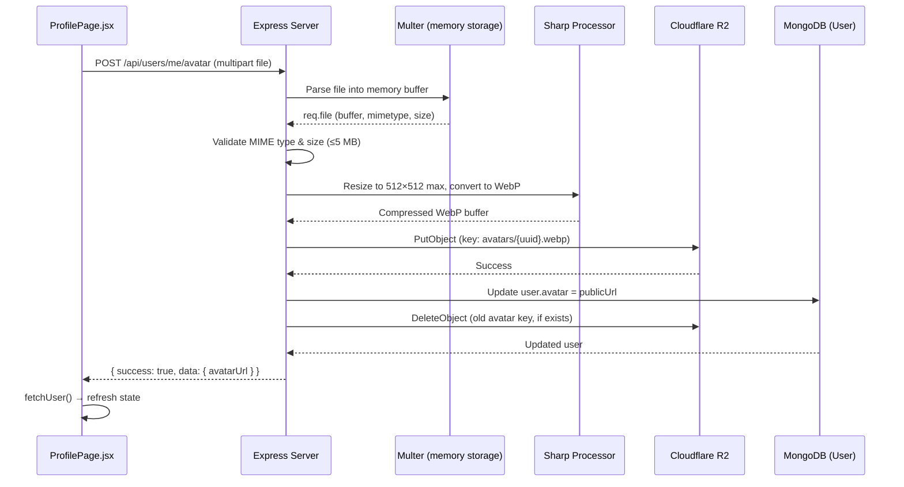
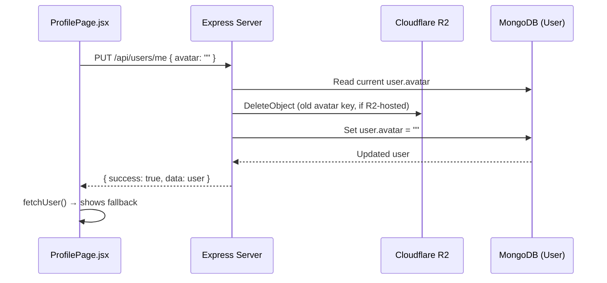

# Design Document: Persistent Profile Picture Upload

## Overview

This design describes how the existing profile page file-selection flow is extended into a full persistent avatar pipeline. A new `POST /api/users/me/avatar` endpoint accepts a multipart image upload, processes it through Sharp (resize to 512×512 max, convert to WebP), stores the result in Cloudflare R2 under an `avatars/` prefix, updates the User document, and cleans up any previously stored avatar. The existing `PUT /api/users/me` endpoint is extended to handle avatar removal (empty string) with R2 cleanup. On the client side, `ProfilePage.jsx` is updated to POST the selected file on save rather than relying on a blob URL, and the `avatar.js` utility continues to provide consistent fallback behavior across all UI surfaces.

## Architecture



### Avatar Removal Flow



## Components and Interfaces

### Server Components

| Component | File | Responsibility |
|-----------|------|----------------|
| Avatar Upload Middleware | `server/middleware/uploadMiddleware.js` | New `uploadAvatar` export — multer with memory storage, image-only filter, 5 MB limit |
| Avatar Controller | `server/controllers/userController.js` | New `uploadAvatar` handler — Sharp processing, R2 upload, DB update, old avatar cleanup |
| User Routes | `server/routes/userRoutes.js` | New `POST /me/avatar` route; modified `PUT /me` for removal cleanup |
| Image Processor | `server/utils/imageProcessor.js` | New `compressAvatar(buffer)` function — 512×512 max, WebP output |

### Client Components

| Component | File | Responsibility |
|-----------|------|----------------|
| ProfilePage | `client/src/pages/ProfilePage.jsx` | File upload on save, loading states, error display, remove button |
| Avatar Utility | `client/src/utils/avatar.js` | Unchanged — already handles empty/present avatar correctly |
| Auth Store | `client/src/store/authStore.js` | Unchanged — `fetchUser()` already refreshes user state |

### API Interface

#### POST /api/users/me/avatar

**Request:**
- Method: `POST`
- Content-Type: `multipart/form-data`
- Body: `avatar` field containing the image file
- Auth: Required (JWT cookie)

**Response (201):**
```json
{
  "success": true,
  "data": {
    "avatarUrl": "https://{R2_PUBLIC_URL}/avatars/{uuid}.webp"
  }
}
```

**Error Responses:**
- `400` — Invalid MIME type or file exceeds 5 MB
- `401` — Not authenticated
- `503` — R2 storage unavailable

#### PUT /api/users/me (modified)

**Request body (avatar removal):**
```json
{
  "avatar": ""
}
```

**Behavior change:** When `avatar` is set to `""` and the current `user.avatar` contains an R2-hosted URL (matches `R2_PUBLIC_URL`), the handler deletes the old R2 object before saving.

## Data Models

No schema changes required. The existing `User.avatar` field (String, maxlength 2048) stores the full public R2 URL after upload, or an empty string after removal.

### R2 Object Key Format

```
avatars/{uuid}.webp
```

- `avatars/` prefix isolates avatar objects from other media
- UUID ensures uniqueness and prevents collisions
- `.webp` extension matches the processed output format

### Detecting R2-Hosted Avatars

To determine whether an existing avatar URL points to R2 (and thus needs cleanup), the server checks if the URL starts with the configured `R2_PUBLIC_URL`. External URLs (e.g., Google profile pictures) are left untouched.

```javascript
function isR2Avatar(url) {
  return url && url.startsWith(config.R2_PUBLIC_URL + '/avatars/');
}

function extractR2Key(url) {
  return url.replace(config.R2_PUBLIC_URL + '/', '');
}
```

## Correctness Properties

*A property is a characteristic or behavior that should hold true across all valid executions of a system — essentially, a formal statement about what the system should do. Properties serve as the bridge between human-readable specifications and machine-verifiable correctness guarantees.*

### Property 1: Upload round-trip consistency

*For any* valid image file (JPEG, PNG, WebP, or GIF, ≤5 MB), uploading it to the avatar endpoint SHALL result in the user's `avatar` field in the database matching the URL returned in the response, and that URL SHALL be prefixed with the R2 public URL followed by `avatars/`.

**Validates: Requirements 1.1, 1.2**

### Property 2: Old avatar cleanup on change

*For any* user whose current `avatar` field contains an R2-hosted URL, uploading a new avatar or setting avatar to an empty string SHALL result in the deletion of the previous R2 object (identified by extracting the key from the old URL).

**Validates: Requirements 1.3, 5.2**

### Property 3: Image processing output constraints

*For any* valid image buffer with dimensions exceeding 512×512, the avatar processing pipeline SHALL produce a WebP buffer whose dimensions fit within a 512×512 bounding box, and the aspect ratio of the output SHALL equal the aspect ratio of the input (within ±1px rounding tolerance).

**Validates: Requirements 2.1, 2.2, 2.3**

### Property 4: Invalid MIME type rejection

*For any* file whose MIME type is not in the set {image/jpeg, image/png, image/webp, image/gif}, the avatar upload endpoint SHALL reject the request with HTTP 400 and the user's `avatar` field SHALL remain unchanged.

**Validates: Requirements 1.4**

### Property 5: R2 failure does not corrupt state

*For any* valid image upload where the R2 PutObject operation fails, the endpoint SHALL return HTTP 503 and the user's `avatar` field in the database SHALL retain its value from before the request.

**Validates: Requirements 1.6**

### Property 6: Avatar utility returns stored URL

*For any* user object whose `avatar` field is a non-empty string, `getUserAvatar(user)` SHALL return that exact string.

**Validates: Requirements 4.1**

### Property 7: Avatar utility fallback generation

*For any* user object whose `avatar` field is empty, null, or undefined, `getUserAvatar(user)` SHALL return a URL containing the user's name as a seed (URL-encoded) and SHALL NOT return an empty string.

**Validates: Requirements 4.2**

## Error Handling

| Scenario | HTTP Status | Response | Side Effects |
|----------|-------------|----------|--------------|
| No file in request | 400 | `{ success: false, error: "No file provided" }` | None |
| Invalid MIME type | 400 | `{ success: false, error: "Only image files (JPEG, PNG, WebP, GIF) are allowed" }` | None |
| File exceeds 5 MB | 400 | `{ success: false, error: "File size must not exceed 5 MB" }` | None |
| Sharp processing fails | 500 | `{ success: false, error: "Image processing failed" }` | None |
| R2 upload fails | 503 | `{ success: false, error: "Storage service unavailable. Please try again later." }` | Avatar field unchanged |
| R2 delete fails (old avatar) | Logged, non-blocking | Upload still succeeds | Orphaned object logged for manual cleanup |
| Not authenticated | 401 | Standard auth error | None |

### Client-Side Error Handling

- Upload errors are displayed inline below the avatar area
- The selected file is retained so the user can retry without re-selecting
- Network timeouts show a generic "Upload failed, please try again" message
- File validation (type, size) is performed client-side before upload for immediate feedback, with server-side validation as the authoritative check

## Testing Strategy

### Unit Tests (Example-Based)

- **Avatar utility**: Verify `getUserAvatar` returns correct URL for users with avatar, and fallback for users without
- **R2 key extraction**: Verify `isR2Avatar` and `extractR2Key` helper functions with known URLs
- **Client upload flow**: Mock API calls, verify ProfilePage sends FormData on save, shows loading state, handles errors
- **Avatar removal**: Verify PUT request with empty avatar triggers R2 cleanup

### Property-Based Tests

Property-based testing is appropriate for this feature because the core logic involves:
- Image processing (pure transformation with clear input/output)
- URL/key manipulation (string operations with invariants)
- Input validation (behavior varies across MIME types and file sizes)

**Library:** [fast-check](https://github.com/dubzzz/fast-check) (already compatible with the project's JavaScript/Node.js stack)

**Configuration:**
- Minimum 100 iterations per property test
- Each test tagged with: `Feature: persistent-profile-picture-upload, Property {N}: {title}`

**Property tests to implement:**
1. **Property 1** — Generate random valid image buffers, mock R2, verify response URL matches DB and has correct prefix
2. **Property 2** — Generate users with random R2-hosted avatar URLs, perform upload/removal, verify old key deletion
3. **Property 3** — Generate random image buffers with varying dimensions, run through `compressAvatar`, verify output dimensions and aspect ratio
4. **Property 4** — Generate random non-image MIME types, verify 400 rejection
5. **Property 5** — Generate valid images with mocked R2 failure, verify 503 and unchanged avatar
6. **Property 6** — Generate random non-empty URL strings as avatar, verify `getUserAvatar` returns them unchanged
7. **Property 7** — Generate user objects with empty/null/undefined avatar, verify fallback URL is non-empty and contains name seed

### Integration Tests

- End-to-end upload flow with real Sharp processing (2-3 representative images)
- Verify multer correctly rejects oversized files at the middleware level
- Verify auth middleware blocks unauthenticated requests
