# Design Document — Realtime Socket System

## Overview

This design integrates Socket.IO into the existing ANTARES2 platform to deliver realtime notifications, live media interactions (likes, comments, tags), an activity feed, and a minimal online-user set. The integration is intentionally **simple, single-process, and additive** — it reuses the existing cookie-based JWT auth path, runs on the default Socket.IO namespace, and exposes a thin `emitToUser` / `emitToEvent` helper that controllers call directly. No event-bus abstractions, no Redis adapter, no namespaces, no advanced presence engine.

The core idea is a small set of well-targeted rooms:

- `user:<userId>` — every authenticated socket joins this on connect; used for personal pushes (notifications, likes on your media, comments on your media, tags).
- `event:<eventId>` — joined on demand from the client when an event album is open; used for live gallery updates and live like/comment counters within an event.

Existing REST flows remain the source of truth. Socket emits are **side-effects** appended after a successful `Model.save()` call inside controllers. If the socket layer is down or the client is disconnected, the REST API continues to work unchanged (Requirement 11.3).

**Cross-cutting requirements addressed:** R1 (server infra), R2 (auth), R3 (notifications), R4 (media updates), R5 (activity feed), R6 (frontend connection mgmt), R7 (notification store/UI), R8 (media interaction store), R9 (Notification model extension), R10 (performance), R11 (integration safety).

---

## Architecture

```mermaid
flowchart LR
  subgraph Client["React Client"]
    A[App.jsx<br/>initAuth] -->|on isAuthenticated| B[socket.js<br/>singleton]
    B --> N1[notificationSocket.js]
    B --> M1[mediaSocket.js]
    B --> AC1[activitySocket.js]
    N1 --> NS[notificationStore]
    M1 --> MS[mediaInteractionStore]
    AC1 --> AS[activityStore]
    NS --> NB[AppNavbar bell]
    MS --> MM[MediaModal]
    MS --> GG[GalleryGrid]
    AS --> FE[Feed UI]
  end

  subgraph Server["Node.js — single process"]
    HTTP[http.createServer&#40;app&#41;] --> IO[Socket.IO default namespace]
    IO --> AUTH[cookie-auth middleware<br/>verifyAccessToken + User lookup]
    AUTH --> ROOM["join user:&lt;id&gt;"]
    ROOM --> RG[Rooms registry<br/>user:* / event:*]

    CTRL[Controllers<br/>media / auth / etc.] -->|emitToUser / emitToEvent| HELPER[sockets/index.js<br/>thin emit helper]
    HELPER --> RG

    CTRL --> DB[(MongoDB<br/>Notification, Media,<br/>Comment, User, Event)]
  end

  B <-->|WebSocket + cookies<br/>withCredentials: true| IO
```



**Key flow:** REST request → controller → Mongoose save → call `emitToUser` / `emitToEvent` → Socket.IO fans out to the matching room → connected clients update their Zustand store → React re-renders.

---

## Components and Interfaces

### Backend modules

#### `server/sockets/index.js`

The single source of truth for Socket.IO setup, auth, room joining, and emit helpers. No event bus. Controllers import the helpers directly.

```js
// Exported functions
export function initSocketServer(httpServer, config): Server  // Validates: R1.1, R1.2, R1.3, R2.5
export function getIO(): Server                                // Validates: R11.1
export function emitToUser(userId, event, payload): boolean    // Validates: R3, R10.1, R10.2
export function emitToEvent(eventId, event, payload): boolean  // Validates: R4, R10.1, R10.2
export function isUserOnline(userId): boolean                  // optional helper used by Presence stub
```

Responsibilities:

1. Attach Socket.IO to the HTTP server with `cors: { origin: config.CLIENT_URL, credentials: true }` and default transports `['websocket', 'polling']`.
2. Register a single connection-level middleware (`io.use(...)`) that:
   - Parses `socket.handshake.headers.cookie` (uses the `cookie` package or a tiny manual parser to extract `accessToken`).
   - Calls the existing `verifyAccessToken(token)` from `server/utils/tokenUtils.js`.
   - Looks up the user via `User.findById(userId).select('-password -refreshToken')`.
   - Rejects with `Error('Authentication required')` if token is missing/invalid or the user is not found.
   - Rejects with `Error('User is blocked')` if `user.isBlocked === true`.
   - Attaches `socket.user = user` and `socket.userId = String(user._id)`.
3. On `connection`:
   - `socket.join('user:' + socket.userId)`.
   - Add `socket.userId` to the in-memory `onlineUsers: Set<string>` (presence stub).
   - Listen for `event:subscribe`/`event:unsubscribe` (payload: `{ eventId }`) to opt-in to `event:<eventId>` rooms — only authenticated sockets can join.
   - On `disconnect`, remove from `onlineUsers` *only if* the user has no other active sockets (look up `io.sockets.adapter.rooms.get('user:' + userId)?.size`).

`emitToUser` and `emitToEvent` apply a **per-(target, event) throttle** of 500ms via an in-memory `Map<string, number>` keyed by `${userId}|${event}` and `${eventId}|${event}` (Requirement 10.2). Returns `true` if emitted, `false` if throttled.

#### `server/sockets/notificationSocket.js`

Pure helpers. No event listeners (notifications are server → client only).

```js
// Validates: R3.1, R3.2, R3.3, R3.4, R3.5, R9.3
export function notifyUser(recipientId, notificationDoc)
export function emitPhotoLikedToOwner(ownerId, { mediaId, count, by })
export function emitNewCommentToUser(recipientId, commentPayload)
export function emitUserTagged(taggedUserId, { mediaId, by })
```

Each helper is a thin wrapper: it builds the payload, calls `emitToUser`, and short-circuits if `recipientId === actorId` (Requirement 3.5).

#### `server/sockets/mediaSocket.js`

```js
// Validates: R4.1, R4.2, R4.3, R4.4
export function emitMediaUploaded(eventId, mediaDoc)
export function emitGalleryUpdated(eventId, summary)
export function emitPhotoLikedToEvent(eventId, { mediaId, count, by })
export function emitNewCommentToEvent(eventId, commentPayload)
```

`gallery-updated` is emitted to the same `event:<eventId>` room rather than a global room. Tradeoff documented in **Performance Considerations** below.

#### `server/sockets/activitySocket.js`

```js
// Validates: R5.1
export function emitActivityUpdate(eventId, activityPayload)
```

Emits `activity-update` to `event:<eventId>`. The client store enforces the 50-item bound (Requirement 5.2, 5.3).

#### `server/sockets/presenceSocket.js`

Minimal stub:

```js
// Validates: R10.3 (cleanup on disconnect)
const onlineUsers = new Set()
export function markOnline(userId)    // called from index.js on connection
export function markOffline(userId)   // called from index.js on disconnect (only if last socket gone)
export function isOnline(userId)
export function getOnlineUserIds()    // optional, for admin/debug
```

This is intentionally a Set — no last-seen timestamps, no per-event presence, no broadcasts of presence changes. The user explicitly requested a simple stub.

### Frontend modules

#### `client/src/sockets/socket.js`

Singleton manager. The whole rest of the client never touches `socket.io-client` directly.

```js
// Validates: R6.1, R6.2, R6.3, R6.5, R10.4, R10.5, R11.2
export function connectSocket(): Socket | null   // no-op if already connected
export function disconnectSocket(): void          // tears down + clears registry
export function getSocket(): Socket | null
export function on(event: string, handler: Function): () => void   // returns unsubscribe
export function off(event: string, handler: Function): void
export function subscribeToEvent(eventId): () => void   // emits 'event:subscribe' + cleanup
export function isConnected(): boolean
```

Internal listener registry shape:

```js
// Map<eventName, Set<handler>>
const handlers = new Map()
// We attach socket.on(eventName, fanOutFn) at most ONCE per eventName.
// fanOutFn iterates handlers.get(eventName) and calls each.
```

Connection config:

```js
io(API_BASE_URL, {
  withCredentials: true,
  transports: ['websocket', 'polling'],
  reconnection: true,
  reconnectionAttempts: Infinity,
  reconnectionDelay: 1000,         // R6.2 base
  reconnectionDelayMax: 30000,     // R6.2 cap (exponential backoff)
  randomizationFactor: 0.5,
})
```

On `reconnect`, because `socket.on` fan-out is attached once per event name (not per handler), reconnection cannot duplicate listeners (Requirement 6.5).

#### `client/src/sockets/notificationSocket.js`

```js
// Validates: R3, R7.2
export function subscribeToNotifications(): () => void
// internally calls: on('notification', handler), on('photo-liked', handler),
//                   on('new-comment', handler), on('user-tagged', handler)
// returns a single unsubscribe that removes all four
```

Each handler routes into `useNotificationStore.getState().addNotification(payload)`.

#### `client/src/sockets/mediaSocket.js`

```js
// Validates: R4, R8.3, R8.4
export function subscribeToMediaUpdates(): () => void
export function subscribeToEventRoom(eventId): () => void   // calls socket.subscribeToEvent + room handlers
```

Routes:

- `media-uploaded` → `useMediaStore.getState().prependMedia(media)` (debounced 300ms, R6.6)
- `gallery-updated` → `useMediaStore.getState().markStale()`
- `photo-liked` → `useMediaInteractionStore.getState().applyRemoteLike({...})` (debounced 300ms)
- `new-comment` → `useMediaInteractionStore.getState().applyRemoteComment({...})`

#### `client/src/sockets/activitySocket.js`

```js
// Validates: R5
export function subscribeToActivity(): () => void
// on('activity-update', handler) -> useActivityStore.getState().addActivity(payload)
```

### Stores

#### `client/src/store/notificationStore.js`

```js
// Validates: R7.1, R7.2, R7.3
{
  list: Notification[],            // newest first
  unreadCount: number,
  addNotification(n: Notification): void,        // prepend + ++unreadCount
  markRead(id: string): void,                    // unreadCount-- if was unread
  markAllRead(): void,
  fetchInitial(): Promise<void>,                 // GET /api/notifications
}
```

#### `client/src/store/activityStore.js`

```js
// Validates: R5.2, R5.3
{
  list: Activity[],     // bounded to 50, newest first
  addActivity(a): void, // prepend; if list.length > 50, slice(0, 50)
}
```

#### `client/src/store/mediaInteractionStore.js`

```js
// Validates: R8.1, R8.2, R8.3, R8.4
{
  // optimistic state keyed by mediaId
  byId: Record<mediaId, { favourited: boolean, favouriteCount: number, comments: Comment[] }>,

  toggleFavourite(mediaId): Promise<void>,   // optimistic + rollback on API failure
  addComment(mediaId, text): Promise<void>,  // optimistic + rollback

  applyRemoteLike({ mediaId, count, by }): void,        // debounced 300ms internally
  applyRemoteComment({ mediaId, comment }): void,       // append if not already present (idempotent by comment._id)
}
```

---

## Data Models

### Notification model — extension (Requirement 9)

**Before** (`server/models/Notification.js`):

```js
{
  type: { enum: ['media_upload', 'user_registration', 'comment'], required: true },
  title, message,
  relatedUser, relatedMedia, relatedEvent,
  isRead, createdAt,
}
```

**After** (additions shown with `// + R9`):

```js
{
  type: {
    type: String,
    enum: [
      'media_upload', 'user_registration', 'comment',  // existing
      'like', 'tag', 'activity'                         // + R9.1
    ],
    required: true
  },
  recipient: {                                          // + R9.2
    type: Schema.Types.ObjectId,
    ref: 'User',
    required: false,    // see migration note below
    index: true
  },
  title, message,
  relatedUser, relatedMedia, relatedEvent,
  isRead, createdAt,
}
```

**Migration consideration.** Existing rows have no `recipient`. Two options, listed in order of preference:

1. **One-time backfill script** (`server/scripts/backfillNotificationRecipient.js`) that infers the recipient from `relatedMedia.uploadedBy` for `media_upload`/`comment` rows and from `relatedUser` for `user_registration`. Run once, then flip `required: true` in a follow-up commit.
2. **Phase in with `required: false`** for one release, then enforce. This is what we ship initially to avoid breaking the existing admin notifications panel during the rollout.

Querying: `Notification.find({ recipient: userId }).sort({ createdAt: -1 })` (Requirement 9.3). The `index: true` keeps this O(log n).

### Comment payload shape (for socket emit)

Comments are emitted in a flattened, populated form so the client doesn't have to refetch:

```ts
type CommentSocketPayload = {
  _id: string,
  mediaId: string,
  eventId: string,           // included so event-room subscribers can filter
  text: string,
  createdAt: string,         // ISO
  user: { _id: string, name: string, avatar: string | null },  // populated subset
}
```

### Activity payload shape

```ts
type ActivityPayload = {
  _id: string,                                    // synthetic; e.g. `${type}:${refId}`
  type: 'media_upload' | 'comment' | 'like' | 'tag',
  eventId: string,
  actor: { _id: string, name: string, avatar?: string },
  target?: { mediaId?: string, commentId?: string, userId?: string },
  message: string,                                // pre-formatted, ready to render
  createdAt: string,                              // ISO
}
```

### Photo-like payload shape

```ts
type PhotoLikedPayload = {
  mediaId: string,
  eventId: string,
  count: number,                                  // updated favourite count (post-toggle)
  by: { _id: string, name: string },
  liked: boolean,                                 // true = favourited, false = unfavourited
}
```

---

## Socket Event Catalog

| Event                  | Direction          | Target room          | Triggered by (server)                         | Payload                                                                 | Validates              |
|------------------------|--------------------|----------------------|-----------------------------------------------|-------------------------------------------------------------------------|------------------------|
| `connection`           | client → server    | (handshake)          | client `connectSocket()`                      | cookies in handshake headers                                            | R2.1                   |
| `event:subscribe`      | client → server    | —                    | client `subscribeToEvent(eventId)`            | `{ eventId: string }`                                                   | R10.1                  |
| `event:unsubscribe`    | client → server    | —                    | client cleanup on unmount                     | `{ eventId: string }`                                                   | R6.4, R10.1            |
| `notification`         | server → client    | `user:<recipientId>` | controllers (after Notification.create)       | `Notification` doc (lean)                                               | R3.1, R7.2             |
| `photo-liked`          | server → client    | `user:<ownerId>`     | `mediaController.toggleFavourite` (favouriting only, owner ≠ actor) | `PhotoLikedPayload`                                | R3.2, R3.5             |
| `photo-liked`          | server → client    | `event:<eventId>`    | `mediaController.toggleFavourite` (always)    | `PhotoLikedPayload`                                                     | R4.3, R10.1            |
| `new-comment`          | server → client    | `user:<recipientId>` | `mediaController.addComment` (owner + prior commenters, dedup, exclude actor) | `CommentSocketPayload`                          | R3.3, R3.5             |
| `new-comment`          | server → client    | `event:<eventId>`    | `mediaController.addComment`                  | `CommentSocketPayload`                                                  | R4.4, R10.1            |
| `user-tagged`          | server → client    | `user:<taggedId>`    | tagging endpoint                              | `{ mediaId, eventId, by: {_id, name} }`                                 | R3.4                   |
| `media-uploaded`       | server → client    | `event:<eventId>`    | `mediaController.uploadMedia`                 | populated `Media` doc                                                   | R4.1                   |
| `gallery-updated`      | server → client    | `event:<eventId>`    | `mediaController.uploadMedia` (after batch)   | `{ eventId, addedCount, latestId }`                                     | R4.2                   |
| `activity-update`      | server → client    | `event:<eventId>`    | controllers (upload/comment/like)             | `ActivityPayload`                                                       | R5.1                   |
| `disconnect`           | client → server    | (auto room cleanup)  | network drop / `disconnectSocket()`           | —                                                                       | R10.3                  |

All server → client emits go through `emitToUser` / `emitToEvent`, which apply the 500ms-per-(target, event) throttle (R10.2).

---

## Authentication Flow

```mermaid
sequenceDiagram
  participant C as Client (socket.js)
  participant IO as Socket.IO server
  participant MW as cookie-auth middleware
  participant TU as verifyAccessToken
  participant DB as User collection

  C->>IO: WS handshake<br/>(Cookie: accessToken=...; withCredentials=true)
  IO->>MW: io.use(handshake)
  MW->>MW: parse Cookie header → accessToken
  alt missing token
    MW-->>C: next(Error('Authentication required'))
    Note over C: client emits 'connect_error'
  else token present
    MW->>TU: verifyAccessToken(accessToken)
    alt invalid / expired
      TU-->>MW: throws
      MW-->>C: next(Error('Authentication required'))
    else valid
      TU-->>MW: { userId }
      MW->>DB: User.findById(userId).select('-password -refreshToken')
      alt no user
        DB-->>MW: null
        MW-->>C: next(Error('Authentication required'))
      else blocked
        DB-->>MW: { isBlocked: true }
        MW-->>C: next(Error('User is blocked'))
      else ok
        DB-->>MW: user
        MW->>IO: socket.user = user
        IO->>IO: socket.join('user:' + user._id)
        IO->>IO: onlineUsers.add(user._id)
        IO-->>C: 'connect' event
      end
    end
  end
```

Validates: R2.1, R2.2, R2.3, R2.4, R2.5, R11.1.

The middleware **reuses** `verifyAccessToken` and the same `select('-password -refreshToken')` projection as `server/middleware/authMiddleware.js` — no auth logic is duplicated (R11.1).

---

## Lifecycle and Cleanup

### Connect

- `App.jsx`: after `initAuth()` resolves and `isAuthenticated === true`, call `connectSocket()` inside a `useEffect` that depends on `isAuthenticated`. The socket is **not** started during hydration to avoid racing with cookie availability.

```jsx
useEffect(() => { if (isAuthenticated) connectSocket(); }, [isAuthenticated])
```

### Disconnect

- `authStore.logout()` calls `disconnectSocket()` *before* clearing user state, ensuring the socket detaches while the cookie is still valid (graceful close).
- `disconnectSocket()` removes every fan-out listener, clears the registry `Map`, and calls `socket.disconnect()`. Subsequent `connectSocket()` calls start fresh.

### Reconnect

Socket.IO's built-in reconnection handles network blips and tab visibility changes. Configuration:

- `reconnection: true`
- `reconnectionDelay: 1000`
- `reconnectionDelayMax: 30000`
- `randomizationFactor: 0.5`
- `reconnectionAttempts: Infinity`

This satisfies R6.2 (exponential backoff 1s → 30s).

### Listener registry (no double-attach)

```js
// socket.js (sketch)
const handlers = new Map() // event -> Set<handler>

function on(event, handler) {
  let set = handlers.get(event)
  if (!set) {
    set = new Set()
    handlers.set(event, set)
    // attach the fan-out listener exactly once for this event name
    socket.on(event, (payload) => {
      for (const h of handlers.get(event) || []) h(payload)
    })
  }
  set.add(handler)
  return () => off(event, handler)
}

function off(event, handler) {
  const set = handlers.get(event)
  if (set) set.delete(handler)
  // We intentionally do NOT call socket.off(event) here — we keep the single
  // fan-out listener attached for the lifetime of the socket. Reconnect cannot
  // create duplicates because we never call socket.on(event, ...) twice.
}
```

This satisfies R6.5: the same handler can be registered once and survive reconnects without ever being double-fired.

### Component unmount cleanup contract

Every component that subscribes MUST capture the unsubscribe and call it in cleanup:

```jsx
useEffect(() => {
  const unsub = subscribeToNotifications()
  return unsub
}, [])
```

Validates: R6.3, R6.4.

---

## Optimistic Update Pattern

### Toggle favourite (Requirement 8.1, 8.2)

```js
// mediaInteractionStore.js (pseudocode)
async toggleFavourite(mediaId) {
  const prev = get().byId[mediaId] ?? { favourited: false, favouriteCount: 0, comments: [] }
  const next = {
    ...prev,
    favourited: !prev.favourited,
    favouriteCount: prev.favouriteCount + (prev.favourited ? -1 : 1),
  }
  set({ byId: { ...get().byId, [mediaId]: next } })   // 1. optimistic
  try {
    const res = await api.post(`/media/${mediaId}/favourite`)
    // 2. reconcile with server truth (count may differ if races occurred)
    set({ byId: { ...get().byId, [mediaId]: { ...next, favouriteCount: res.data.favouriteCount } } })
  } catch (err) {
    set({ byId: { ...get().byId, [mediaId]: prev } })  // 3. rollback
    throw err
  }
}
```

### Add comment (Requirement 8.4)

```js
async addComment(mediaId, text) {
  const tempId = `tmp:${Date.now()}`
  const prev = get().byId[mediaId] ?? { ..., comments: [] }
  const optimistic = { _id: tempId, text, user: currentUser(), createdAt: new Date().toISOString(), pending: true }
  set({ byId: { ...get().byId, [mediaId]: { ...prev, comments: [...prev.comments, optimistic] } } })
  try {
    const res = await api.post(`/media/${mediaId}/comments`, { text })
    // replace temp with real
    const real = { ...res.data, user: optimistic.user, pending: false }
    set(state => ({
      byId: { ...state.byId, [mediaId]: {
        ...state.byId[mediaId],
        comments: state.byId[mediaId].comments.map(c => c._id === tempId ? real : c),
      } }
    }))
  } catch (err) {
    set(state => ({ byId: { ...state.byId, [mediaId]: prev } }))
    throw err
  }
}
```

### Reconciliation with realtime echoes

The server emits `photo-liked` / `new-comment` to the event room *including* the actor's session. To prevent double-counting:

- `applyRemoteLike` always **sets** `favouriteCount` to the server-provided count (idempotent), it does not increment.
- `applyRemoteComment` checks `comments.some(c => c._id === incoming._id)` before appending (idempotent by `_id`).

This satisfies R8.3, R8.4 and avoids the "I clicked once, count went up by two" class of bug.

---

## Performance Considerations

### Targeted delivery (R10.1)

- All emits go to either `user:<id>` or `event:<id>`. There is no `io.emit(...)` global broadcast anywhere in the codebase. `gallery-updated` is scoped to `event:<eventId>` (the event whose gallery changed) — components viewing other events are unaffected. Tradeoff: a user on the `/gallery` page (cross-event) won't see live additions; they get them on next pagination refresh. This is an acceptable simplification for the scope and is documented for future extension to a `gallery:global` room if needed.

### Server-side per-user emit throttle (R10.2)

```js
// sockets/index.js (sketch)
const lastEmit = new Map()  // key: `${target}|${event}`
const THROTTLE_MS = 500

function throttled(key) {
  const now = Date.now()
  const last = lastEmit.get(key) ?? 0
  if (now - last < THROTTLE_MS) return true
  lastEmit.set(key, now)
  return false
}

export function emitToUser(userId, event, payload) {
  const key = `u:${userId}|${event}`
  if (throttled(key)) return false
  getIO().to(`user:${userId}`).emit(event, payload)
  return true
}
```

A best-effort cleanup runs every 60s to drop entries older than `THROTTLE_MS * 10` so the Map doesn't grow unbounded. Single-process only — that's the agreed scope.

### Client-side debounce (R6.6)

A tiny `debounce(fn, ms)` utility in `client/src/utils/debounce.js`. Wired around the high-frequency UI updaters: `applyRemoteLike` and the `media-uploaded` prepend. Comments are *not* debounced — users expect them to appear immediately and they are intrinsically rate-limited by typing speed.

### Bounded activity list (R5.2, R5.3)

`activityStore.addActivity` always slices to 50 after prepending:

```js
addActivity(a) {
  set(state => ({ list: [a, ...state.list].slice(0, 50) }))
}
```

### Disconnect cleanup (R10.3)

Socket.IO automatically removes a disconnecting socket from all its rooms. We additionally remove the `userId` from `onlineUsers` only if the user has no other live sockets in `user:<id>` (multi-tab safety).

### No re-render loops (R10.4)

- All store updates use Zustand's shallow-merge `set`. Components read narrow selectors (`useNotificationStore(s => s.unreadCount)`).
- Debouncing on the highest-frequency events.
- The fan-out listener model means handlers run once per event regardless of how many components are subscribed.

---

## Integration Safety

### `server/index.js` — the only required change

```diff
 import express from 'express';
+import http from 'http';
 import cors from 'cors';
 // ... existing imports ...
+import { initSocketServer } from './sockets/index.js';

 const config = validateEnv();
 await connectDB();
 const app = express();
 // ... existing middleware in EXACT current order:
 //   passport.initialize, cors, cookieParser, express.json,
 //   /api/auth, /api/events, /api/media, /api/users, /api/admin, errorHandler

-app.listen(config.PORT, () => {
-  console.log(`Server running on port ${config.PORT}`);
-});
+const httpServer = http.createServer(app);
+initSocketServer(httpServer, config);
+httpServer.listen(config.PORT, () => {
+  console.log(`Server running on port ${config.PORT}`);
+});

 export default app;
```

Validates: R1.1, R1.4, R11.4. **No middleware reordering, no route changes, no error-handler changes.**

### Controller hook insertion points (`server/controllers/mediaController.js`)

These are *append-only* additions inside existing handlers, after the existing `res.status(...).json(...)` data has been computed but before it is sent (or right after, since the emit is fire-and-forget). Using a `process.nextTick` keeps response latency unchanged.

- **`uploadMedia`** — after the `for` loop, before the final `res.status(201)`:
  ```js
  for (const m of uploaded) emitMediaUploaded(eventId, m)
  if (uploaded.length > 0) emitGalleryUpdated(eventId, { addedCount: uploaded.length, latestId: uploaded[0]._id })
  ```
- **`toggleFavourite`** — after `await media.save()`:
  ```js
  const eventId = String(media.eventId)
  const ownerId = String(media.uploadedBy)
  const actorId = String(req.user._id)
  emitPhotoLikedToEvent(eventId, { mediaId: id, eventId, count: media.favouritedBy.length, by: { _id: actorId, name: req.user.name }, liked: favourited })
  if (favourited && ownerId !== actorId) {
    const notif = await Notification.create({ type: 'like', recipient: ownerId, relatedUser: actorId, relatedMedia: id, title: 'New like', message: `${req.user.name} liked your photo` })
    notifyUser(ownerId, notif)
    emitPhotoLikedToOwner(ownerId, { mediaId: id, count: media.favouritedBy.length, by: { _id: actorId, name: req.user.name } })
  }
  ```
- **`addComment`** — after `await media.save()`:
  ```js
  const populated = await comment.populate('userId', 'name avatar')
  const payload = { _id: populated._id, mediaId: id, eventId: String(media.eventId), text: populated.text, createdAt: populated.createdAt, user: { _id: populated.userId._id, name: populated.userId.name, avatar: populated.userId.avatar ?? null } }
  emitNewCommentToEvent(payload.eventId, payload)
  // recipients: media owner + previous commenters, dedup, exclude actor
  const priorCommenterIds = await Comment.find({ mediaId: id }).distinct('userId')
  const recipientIds = new Set([String(media.uploadedBy), ...priorCommenterIds.map(String)])
  recipientIds.delete(String(req.user._id))
  for (const rid of recipientIds) {
    const notif = await Notification.create({ type: 'comment', recipient: rid, relatedUser: req.user._id, relatedMedia: id, title: 'New comment', message: `${req.user.name} commented on a photo` })
    notifyUser(rid, notif)
    emitNewCommentToUser(rid, payload)
  }
  ```
- **Tagging** — minimal new endpoint `POST /api/media/:id/tag` accepting `{ userIds: string[] }`:
  ```js
  for (const taggedId of unique(userIds)) {
    if (String(taggedId) === String(req.user._id)) continue
    const notif = await Notification.create({ type: 'tag', recipient: taggedId, relatedUser: req.user._id, relatedMedia: id, title: 'You were tagged', message: `${req.user.name} tagged you` })
    notifyUser(taggedId, notif)
    emitUserTagged(taggedId, { mediaId: id, eventId: String(media.eventId), by: { _id: req.user._id, name: req.user.name } })
  }
  ```

### Backwards compatibility

- If the socket layer fails to initialize, the HTTP server still listens — `initSocketServer` is wrapped in a try/catch that logs and returns. REST keeps working (R11.3).
- If a controller's emit throws (e.g., `getIO()` not initialized in a test), the helper catches and logs. Controllers do not propagate emit errors to the HTTP response.

---

## Error Handling

| Failure                                       | Server behavior                                     | Client behavior                                                    |
|-----------------------------------------------|-----------------------------------------------------|--------------------------------------------------------------------|
| Missing/invalid cookie at handshake           | `next(Error('Authentication required'))`            | `connect_error` — no retry storm; surfaces silently in console     |
| Token valid but user deleted                  | `next(Error('Authentication required'))`            | same as above                                                      |
| User `isBlocked`                              | `next(Error('User is blocked'))`                    | client logs out via existing axios 403 path on next REST call      |
| Disconnect mid-emit (target user offline)     | Emit lands in zero-membership room → no-op          | On reconnect, client refetches via `notificationStore.fetchInitial()` |
| `Notification.create` throws                  | Controller responds 500; **emit is skipped**        | UI never sees a phantom notification                               |
| Socket layer init failure                     | Logged; HTTP server still listens                   | Client retries indefinitely; UI feature-degrades to REST polling   |
| Optimistic API call fails                     | (n/a)                                               | Store rollback to `prev` snapshot (R8.2)                           |
| Notification with no `recipient` (legacy row) | Backfill script or `required: false` phase          | Filtered out of personal feed; visible in admin panel only         |

---

## Testing Strategy

### What we test with property-based tests (PBT)

PBT applies to a focused set of pure logic: the listener registry, the throttle helper, the optimistic-rollback reducer, and the recipient-set deduplication. These are pure JS functions with universal invariants over arbitrary inputs — exactly where PBT shines. We use **fast-check** (already idiomatic for JS/TS).

Each property test runs ≥ 100 iterations and is tagged:
```js
// Feature: realtime-socket-system, Property N: <text>
```

### What we test with examples / integration

- **Auth middleware**: a small set of example tests (no token, bad token, blocked user, happy path) using `vitest` and a mocked `User.findById`.
- **Server emit wiring**: spin up an in-memory `Server` from `socket.io`, connect a mock client, assert that an `emitToUser` call delivers to the right room. 1–3 examples; behavior doesn't vary meaningfully with input.
- **Controller hook insertion**: vitest-level test that calls `toggleFavourite` against a stubbed `Media`, asserts `emitPhotoLikedToEvent` was called with the expected shape and that no emit occurred when the actor is the owner (R3.5).
- **End-to-end smoke**: manual scenarios documented for QA — login, open event album, open second tab, like a photo, see live count update; logout in tab A, confirm tab B socket also disconnects.

### Frontend tests

- Store unit tests with vitest: `addNotification` increments `unreadCount`, `addActivity` enforces 50-cap, `toggleFavourite` rolls back on rejected promise.
- Listener registry unit + property test (see Correctness Properties below).

---

## Correctness Properties

*A property is a characteristic or behavior that should hold true across all valid executions of a system — essentially, a formal statement about what the system should do. Properties serve as the bridge between human-readable specifications and machine-verifiable correctness guarantees.*

The properties below are the consolidated, non-redundant set produced by the prework analysis. Each is implementable as a single property-based test (≥ 100 iterations) using fast-check. Smoke / example / integration concerns are covered by the Testing Strategy section above.

### Property 1: Cookie parsing extracts `accessToken` correctly

*For any* Cookie header string composed of zero or more `name=value` pairs separated by `;` (with arbitrary surrounding whitespace), the cookie parser SHALL return the value associated with `accessToken` if such a pair is present, and SHALL return `null` otherwise. The result must equal a reference parser that splits on `;`, trims, and matches `^accessToken=`.

**Validates: Requirements 2.1**

### Property 2: Successful auth always joins `user:<userId>` and never any other user room

*For any* userId that yields a valid token and a non-blocked user, after the auth middleware runs against a fresh mock socket, `socket.rooms` SHALL contain `'user:' + userId` and SHALL NOT contain `'user:' + otherId` for any `otherId !== userId`.

**Validates: Requirements 2.5, 11.1**

### Property 3: Room-targeted emits land only on the matching room

*For any* call to `emitToUser(userId, event, payload)` or `emitToEvent(eventId, event, payload)`, only sockets that have joined `user:<userId>` (respectively `event:<eventId>`) SHALL receive the event. Sockets in other rooms SHALL receive zero emits for that call.

**Validates: Requirements 3.1, 3.4, 4.1, 4.2, 5.1, 10.1**

### Property 4: Comment recipient set is `dedup({owner} ∪ priorCommenters) \ {actor}`

*For any* tuple `(ownerId, priorCommenterIds, actorId)`, the set of user rooms that receive a `notification` + `new-comment` emit triggered by `addComment` SHALL equal the deduplicated union of `{ownerId}` and `priorCommenterIds` with `actorId` removed. Equivalently: each non-actor recipient receives exactly one emit, and the actor receives zero.

**Validates: Requirements 3.3, 3.5, 4.4**

### Property 5: `photo-liked` emit conditions and count correctness

*For any* tuple `(initialFavouritedBy: UserId[], actorId, ownerId)` and toggle action, after the controller runs:
1. The `event:<eventId>` room SHALL receive exactly one `photo-liked` emit whose `count` equals the post-toggle length of `favouritedBy`.
2. The owner's `user:<ownerId>` room SHALL receive a `photo-liked` emit *if and only if* the action favourited (not unfavourited) the media AND `ownerId !== actorId`.

**Validates: Requirements 3.2, 3.5, 4.3**

### Property 6: Server-side per-(target, event) throttle is bounded

*For any* sequence of `emitToUser(userId, event, payload)` calls (and equivalently `emitToEvent`) issued within a window of duration `T`, the number of emits that actually reach the underlying `io.to(...).emit(...)` SHALL be at most `ceil(T / 500ms)` for that `(target, event)` pair.

**Validates: Requirements 10.2**

### Property 7: Listener registry never double-attaches and `off` removes only the targeted handler

*For any* sequence of `on(event, handler)` and `off(event, handler)` operations followed by any number of simulated reconnections, when the underlying socket emits `event` once:
1. Each handler currently registered for `event` SHALL be invoked exactly once.
2. Handlers that were `off`'d or never `on`'d SHALL be invoked zero times.
3. The number of native `socket.on` listeners for `event` SHALL equal exactly 1 (the fan-out listener) regardless of the number of registrations or reconnections.

**Validates: Requirements 6.4, 6.5**

### Property 8: `disconnectSocket()` clears the registry and silences subsequent emits

*For any* sequence of `on(event, handler)` calls, after `disconnectSocket()` is called, the registry SHALL be empty and any subsequent fake socket emit SHALL invoke zero handlers.

**Validates: Requirements 6.3**

### Property 9: Client debounce yields one trailing call per window

*For any* burst of `N` calls to a `debounce(fn, 300)` wrapper issued within a window of duration `W`, the wrapped function SHALL be invoked exactly `ceil(W / 300ms)` times in the worst case (and exactly 1 time when `W < 300ms` and `N ≥ 1`), with the most recent argument.

**Validates: Requirements 6.6, 10.4**

### Property 10: Notification store invariant — `unreadCount` equals count of unread items

*For any* sequence of `addNotification`, `markRead(id)`, and `markAllRead()` operations applied to the notification store, immediately after each operation the invariant `state.unreadCount === state.list.filter(n => !n.isRead).length` SHALL hold, and the most recently added notification SHALL be at index 0.

**Validates: Requirements 7.1, 7.2, 7.3**

### Property 11: Activity store is bounded to 50 newest-first

*For any* sequence of `addActivity` calls, immediately after each call `state.list.length <= 50` SHALL hold, the most recently added activity SHALL be at index 0, and the items in the list SHALL be ordered by insertion order (newest first).

**Validates: Requirements 5.2, 5.3**

### Property 12: Optimistic `toggleFavourite` round-trips state on API rejection

*For any* initial store state and any `mediaId`, calling `toggleFavourite(mediaId)` and then having the underlying API reject SHALL leave the store's `byId[mediaId]` strictly equal to its pre-call value (deep equality). When the API resolves, the store SHALL reflect the toggled state with `favouriteCount` taken from the server response.

**Validates: Requirements 8.1, 8.2**

### Property 13: `applyRemoteLike` and `applyRemoteComment` are idempotent

*For any* store state `s` and any payload `p`, the equalities `applyRemoteLike(applyRemoteLike(s, p), p) === applyRemoteLike(s, p)` and `applyRemoteComment(applyRemoteComment(s, p), p) === applyRemoteComment(s, p)` SHALL hold (deep equality). Specifically, a duplicate `new-comment` payload (same `_id`) SHALL NOT cause the comment to appear twice, and a duplicate `photo-liked` payload SHALL NOT change the count beyond the value carried in the payload.

**Validates: Requirements 8.3, 8.4**

